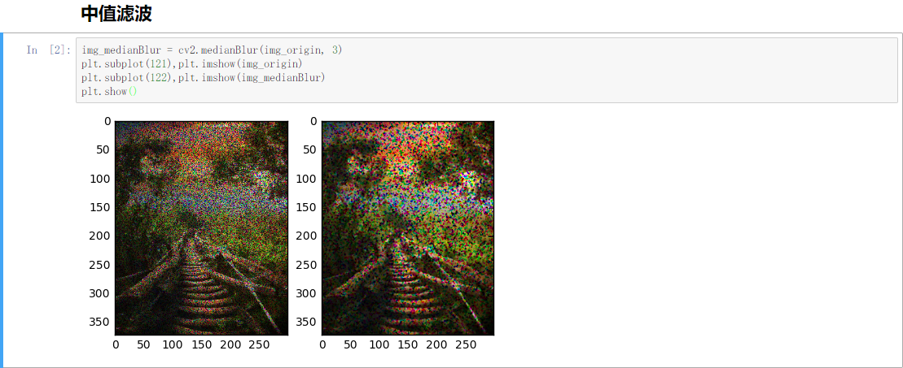
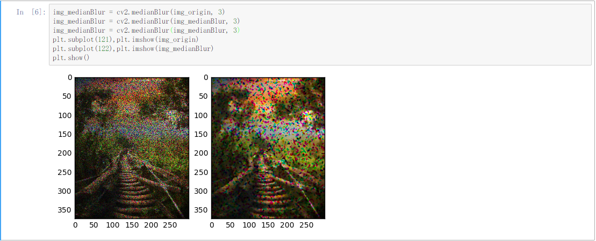
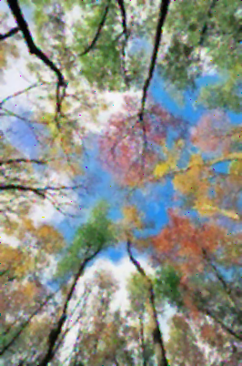
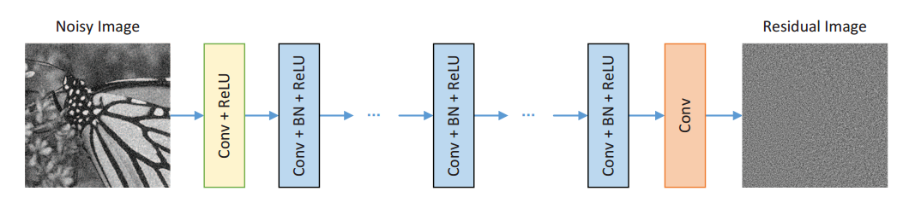
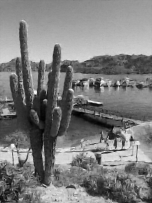
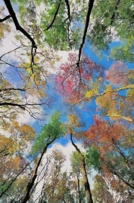

# Image-Denoising
### 问题

给定污染方式已知的图像，尝试恢复他们的原始图像。

### 具体污染方式

1. 受损图像$X$由原始图像($(I\in R^{H\cdot W \cdot C})$添加不同的噪声遮罩$(M\in R^{H\cdot W\cdot C})$得到的，$(X=I\odot M)$，$\odot$为逐元素相乘。
2. 噪声遮罩仅包含{0, 1}值，分别对应原图的每行用0.8/0.4/0.6的噪声比率产生，即噪声遮罩的每个通道每行80%/40%/60%的像素值为0，其他为1。

### 恢复

#### 基于传统滤波的考虑

##### 概述

实际上，根据噪声的产生方式，图片噪声实际上是一种比较特殊的椒盐噪声(随机改变一些像素值，使得一些像素点变黑，一些像素点变白)。于是，我们使用一些传统的滤波方式去试图去除噪声。这部分工作主要借助于opencv这个图像处理库来实现，它提供了绝大部分滤波函数的封装。

[滤波处理代码](./filter/filter.ipynb) 

##### 中值滤波



椒盐噪声实际上经常用中值滤波这种比较简单的方式去除，我们使用中值滤波去试图还原，发现有一定的去除效果，但是仍会残留许多的噪点。



我们试图增加中值滤波的迭代次数，发现此时的噪声趋于颗粒化，因为噪点的半径越来越大， 如果我们想要试图去除，就需要更大的中值半径，但这样，牺牲图像的细节品质也会越大。所以，中值滤波是一次失败的尝试。

##### 其他滤波方式

接下来我们尝试了，均值滤波，高斯滤波这些传统的线性滤波操作。以及除去中值滤波之外的其他非线性滤波操作，包括双边滤波，非局部均值滤波(NLMeans)，以及在去噪方面效果显著的BM3D算法等。效果都不尽人意。

##### 逆谐波均值滤波

当然我们也发现了一个比较好的滤波方法，逆谐波均值滤波，即IHMeans。

我们对于基本的IHMeans给出来了实现，因为原图中只有那些不为黑色的点是可信的点。我们在每次滤波完成之后恢复这些点的数据，继续下一次迭代。通过比较多次的迭代的MSE，实际上这种方法很快就会达到收敛。

[IHMeans代码](./filter/IHMeans.py)

实际上这个方法的核心是在于对于每一个局部空间应用一下IHMeans算子: $f(x,y)=\frac{\sum g(s,t)^{Q+1}}{\sum g(s,t)^{Q}}$。

我们默认的迭代次数是3次。

##### 滤波结果

 

 

 

三幅图都实现了基本的去噪，但是很明显的，由于使用了滤波的方法，就难以克服滤波的天生缺陷，对于细节的损失比较明显，图片整体平滑化了。并且，没有应用到80%/40%/60%这几个敏感的mask参数。

#### 基于DNCNN的图片去噪

这部分主要参照于论文[Beyond a Gaussian Denoiser: Residual Learning of Deep CNN for Image Denoising](http://www4.comp.polyu.edu.hk/~cslzhang/paper/DnCNN.pdf)。

数据集来自[CIFAR-10数据集](http://www.cs.toronto.edu/~kriz/cifar.html )。

##### 数据预处理

1. 对于三通道，我们直接读取CIFAR数据集中的图片内容，通过numpy转化成对应的图像矩阵即可。
2. 对于单通道，即黑白图像，我们也先通过读取CIFAR的数据集的内容，然后通过转化公式，将RGB模式转化为灰度图模式。

##### 数据遮罩

因为给定了图像污染的规则，我们只需要对原始数据进行固定percent的图像遮罩，可以得到供训练使用的noised images。

##### 损失函数

设原图为Y\_，我们施加遮罩后的图像为X，通过CNN输出的图像为Y，损失函数即为Y和Y\_的图像差。

##### 模型结构

[模型代码](./cnn/model.py)

  

##### 模型训练

```bash
$ python main.py --phase train --percent 0.4 --channel 3
```

GTX1080下训练大约在10min左右。训练结果保存在相应的checkpoint文件夹下。

##### 模型测试

```bash
$ python main.py --phase test --percent 0.4 --channel 3 --input B
```

##### 测试结果

 

 

 

#### 两种方法结果的对比

 

 

 

