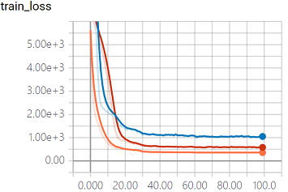
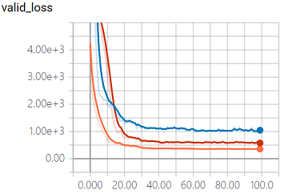

# IRCNN

## 滤波

[滤波处理代码](./filter/filter.ipynb)

### 逆谐波均值滤波

[IHMeans代码](./filter/IHMeans.py)

```bash
$ python IHMeans.py --input A
```

## CNN

[DnCNN](http://www4.comp.polyu.edu.hk/~cslzhang/paper/DnCNN.pdf) [IRCNN](http://openaccess.thecvf.com/content_cvpr_2017/papers/Zhang_Learning_Deep_CNN_CVPR_2017_paper.pdf)

### 数据集

[CIFAR-10数据集](http://www.cs.toronto.edu/~kriz/cifar.html )。

### 模型训练

```bash
$ python main.py --phase train --percent 0.4 --channel_num 3 --model_type=ircnn
```

### 模型测试

```bash
$ python main.py --phase test --channel_num 3 --input B --model_type=ircnn
```

### 训练过程

  

