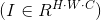
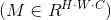
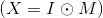
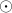
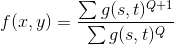

# Image-Denoising

## 污染方式

1. 受损图像由原始图像添加不同的噪声遮罩得到的，，为逐元素相乘。
2. 噪声遮罩仅包含{0, 1}值，分别对应原图的每行用0.8/0.4/0.6的噪声比率产生，即噪声遮罩的每个通道每行80%/40%/60%的像素值为0，其他为1。

## 恢复

### 传统滤波

[滤波处理代码](./filter/filter.ipynb)

#### 逆谐波均值滤波

当然我们也发现了一个比较好的滤波方法，逆谐波均值滤波，即IHMeans。

实际上这个方法的核心是在于对于每一个局部空间应用一下IHMeans算子: 。

我们对于基本的IHMeans给出来了实现，基本的IHMeans已经完成了对于噪点的去除，我们在这个基础上做了一些改进。

因为原图中那些未被删除的点是可信的点，我们可以充分利用这些点的确定性。在每次滤波完成之后恢复这些点的数据，继续下一次迭代。这种改进的迭代方法会被基本的IHMeans效果来的更好一些。但是不幸的是，这个类IHMeans方法很快就会达到收敛，没有更大的改善空间。

我们默认的迭代次数是3次。3次之内一般图片都可以达到收敛，并且都能得到一个比较好的效果。

[IHMeans代码](./filter/IHMeans.py)

```bash
$ python IHMeans.py --input A
```

### CNN

参照于论文[Beyond a Gaussian Denoiser: Residual Learning of Deep CNN for Image Denoising](http://www4.comp.polyu.edu.hk/~cslzhang/paper/DnCNN.pdf)。

数据集来自[CIFAR-10数据集](http://www.cs.toronto.edu/~kriz/cifar.html )。

#### 数据预处理

1. 对于三通道，我们直接读取CIFAR数据集中的图片内容，通过numpy转化成对应的图像矩阵即可。
2. 对于单通道，即黑白图像，我们也先通过读取CIFAR的数据集的内容，然后通过转化公式，将RGB模式转化为灰度图模式。具体的转化公式是 `Y = 0.299 R + 0.587 G + 0.114 B` 。

这样我们就充分利用了CIFAR-10数据集，得到了三通道和单通道的两类不同的实际数据集。

#### 数据遮罩

因为已经给定了图像污染的规则，那我们通过数据集得到的数据是clean images，是我们的目标函数。通过施加给定的噪声遮罩，我们可以得到noised images，作为训练的输入参数X。

[模型代码](./cnn/model.py)

#### 模型训练

```bash
$ python main.py --phase train --percent 0.4 --channel 3
```

其他参数像learning rate, batch size等都给了默认值。

GTX1080下训练大约在10min左右。训练结果保存在相应的checkpoint文件夹下。

#### 模型测试

```bash
$ python main.py --phase test --percent 0.4 --channel 3 --input B
```


